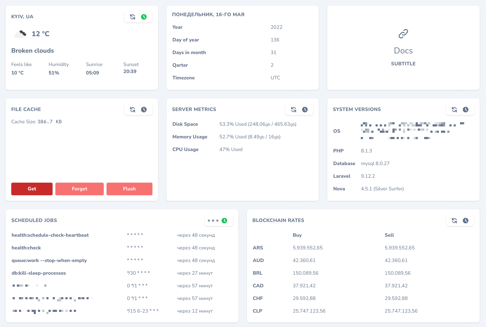
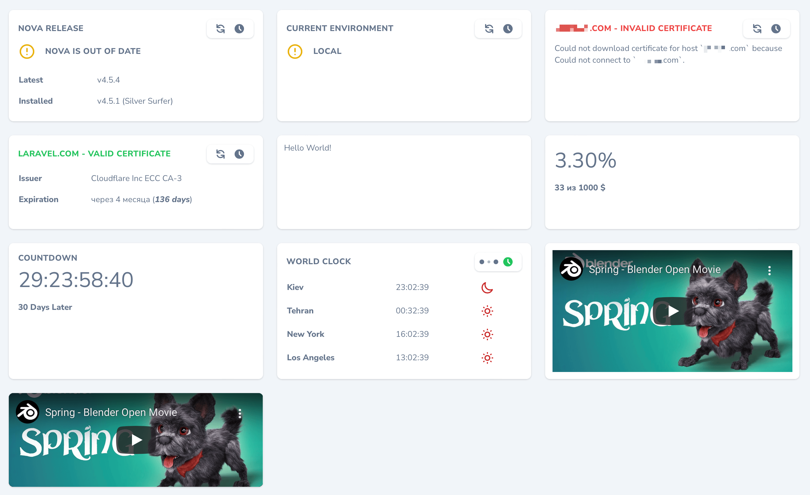
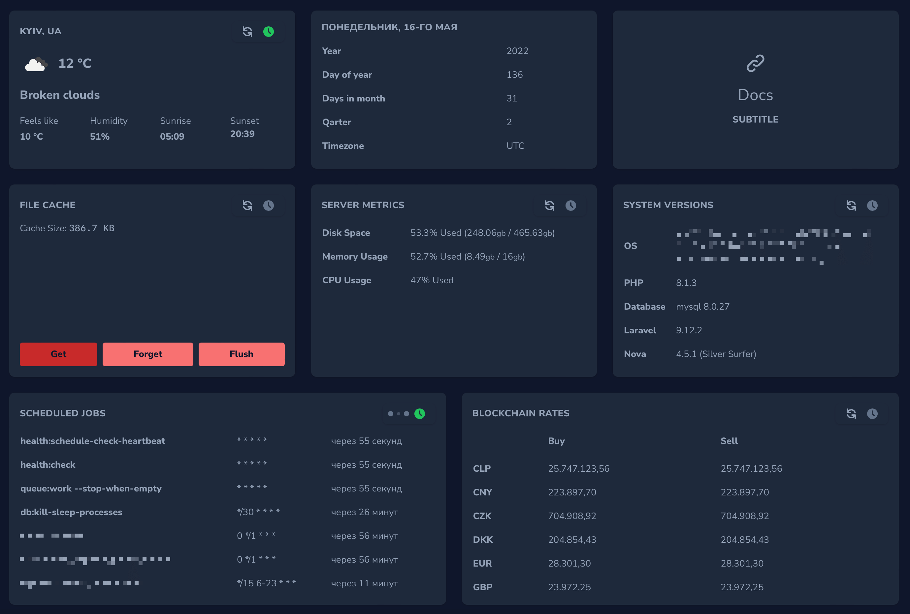
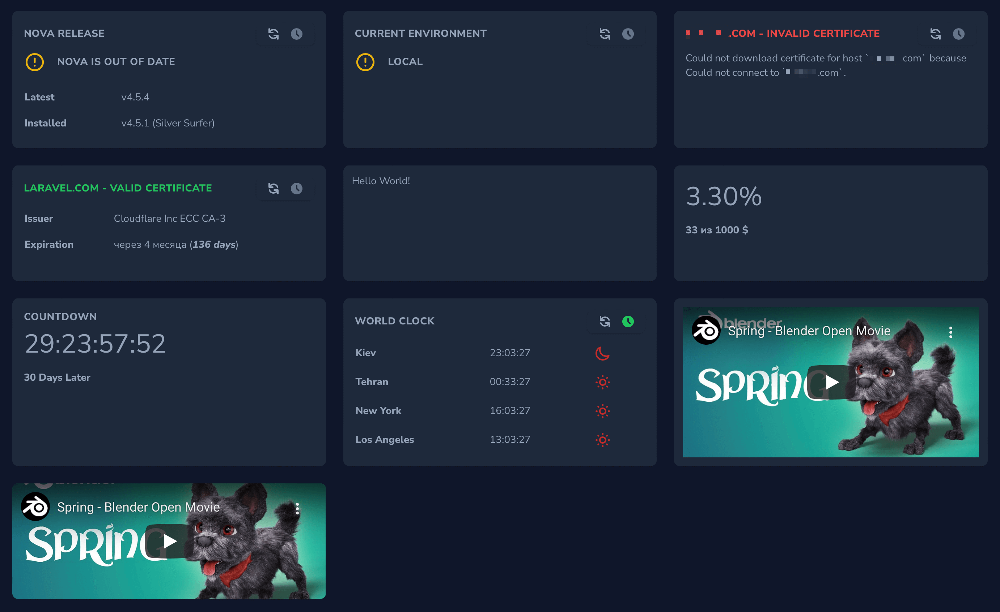
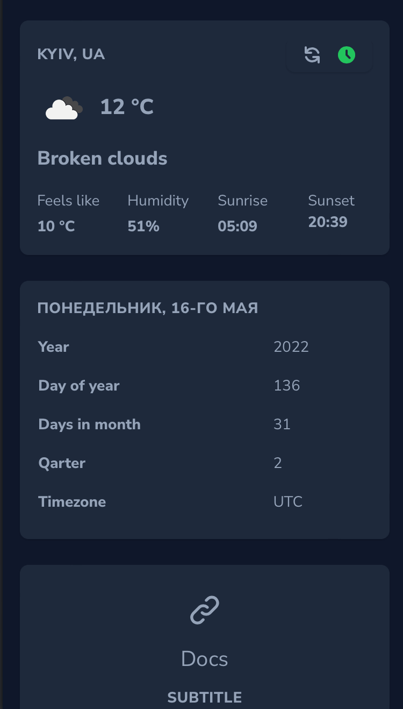

# Cards for Laravel Nova

[](https://packagist.org/packages/stepanenko3/nova-cards)
[](https://packagist.org/packages/stepanenko3/nova-cards)
[](https://packagist.org/packages/stepanenko3/nova-cards)




## List of Cards

- BlockchainExchangeCard
- CacheCard
- CountdownCard
- EmbedCard
- EnvironmentCard
- HtmlCard
- LinkableCard
- PercentageCard
- ScheduledJobsCard
- SslCard
- SystemResourcesCard
- VersionsCard
- WorldClockCard
- WeatherCard
- CalendarCard
- NovaReleaseCard
- GreetingCard

## Requirements

- `php: >=8.0`
- `laravel/nova: ^4.0`

## Installation

```bash
# Install the package
composer require stepanenko3/nova-cards
```

Register the cards with Nova in the `cards()` method of the your Dashboards class:

```php
// in app/Nova/Dashborads/Cards.php

use Stepanenko3\NovaCards\Cards\GreetingCard;
use Stepanenko3\NovaCards\Cards\BlockchainExchangeCard;
use Stepanenko3\NovaCards\Cards\CacheCard;
use Stepanenko3\NovaCards\Cards\CountdownCard;
use Stepanenko3\NovaCards\Cards\EmbedCard;
use Stepanenko3\NovaCards\Cards\EnvironmentCard;
use Stepanenko3\NovaCards\Cards\HtmlCard;
use Stepanenko3\NovaCards\Cards\LinkableCard;
use Stepanenko3\NovaCards\Cards\PercentageCard;
use Stepanenko3\NovaCards\Cards\ScheduledJobsCard;
use Stepanenko3\NovaCards\Cards\SslCard;
use Stepanenko3\NovaCards\Cards\SystemResourcesCard;
use Stepanenko3\NovaCards\Cards\VersionsCard;
use Stepanenko3\NovaCards\Cards\WorldClockCard;
use Stepanenko3\NovaCards\Cards\WeatherCard;
use Stepanenko3\NovaCards\Cards\CalendarCard;
use Stepanenko3\NovaCards\Cards\NovaReleaseCard;

public function cards()
{
    $user = auth()->user();

    return [
        GreeterCard::make()
            ->user(
                name: $user->name,
                title: 'Admin',
            )
            ->message(
                text: 'Welcome back,',
            )
            ->button(
                name: 'Profile',
                target: '/nova/resources/users/' . $user->id,
            )
            ->button(
                name: 'Users',
                target: '/nova/resources/users',
            )
            ->avatar(
                url: $user->avatar
                    ? storage_url($user->avatar, 'public')
                    :  'https://ui-avatars.com/api/?size=300&color=7F9CF5&background=EBF4FF&name=' . $user->name
            ),

        (new WeatherCard)
            ->pollingTime(60000) // Optional
            ->startPolling(), // Optional. Auto start polling

        (new CalendarCard),

        (new LinkableCard)
            ->title('Docs') // Required
            ->subtitle('subtitle') // Optional
            ->url('/') // Required
            ->target('_blank'), // Default: _self

        (new CacheCard),

        (new SystemResourcesCard),

        (new VersionsCard),

        (new ScheduledJobsCard)
            ->startPolling() // Optional. Auto start polling
            ->pollingTime(1000)
            ->width('1/2'),

        (new BlockchainExchangeCard)
            ->width('1/2'),

        (new NovaReleaseCard),

        (new EnvironmentCard),

        (new SslCard)
            ->domain('test.com'), // Required

        (new SslCard)
            ->domain('laravel.com'), // Required

        (new HtmlCard)
            ->width('1/3')
            ->html('<h1>Hello World!</h1>'), // Required

        (new HtmlCard)
            ->width('1/3')
            ->markdown('# Hello World!'), // Required

        (new HtmlCard)
            ->width('1/3')
            ->view('cards.hello', ['name' => 'World']), // Required

        (new PercentageCard)
            ->name('Demo percents') // Optional
            ->label('$') // Optional
            ->count(33) // Required
            ->total(1000) // Required
            ->percentagePrecision(2), // Default: 2

        (new CountdownCard)
            ->to(now()->addDays(30)) // Required
            ->title('30 Days Later') // Optional
            ->label('30 Days Later'), // Optional

        (new WorldClockCard())
            ->timezones([ // Required
                'Europe/Kiev',
                'Asia/Tehran',
                'America/new_york',
                'America/los_angeles',
            ])
            ->timeFormat('H:i:s') // Optional time format default is: 'H:i:s'
            ->startPolling() // Optional. Auto start polling
            ->pollingTime(1000) // Optional
            ->title(__('World Clock')), // Optional

        // A most simple embed
        (new EmbedCard)
            ->url('https://www.youtube.com/embed/WhWc3b3KhnY'), // Required

        // A more complex embed of raw <iframe>...</iframe> HTML
        (new EmbedCard)
            ->withoutPadding() // Optional remove padding in card
            ->url('https://www.youtube.com/embed/WhWc3b3KhnY'), // Required
    ];
}
```

## Usage

Open your Dashboard in your Nova app to see the cards.

## Screenshots





## Credits

- [Artem Stepanenko](https://github.com/stepanenko3)

## Contributing

Thank you for considering contributing to this package! Please create a pull request with your contributions with detailed explanation of the changes you are proposing.

## License

This package is open-sourced software licensed under the [MIT license](LICENSE.md).
